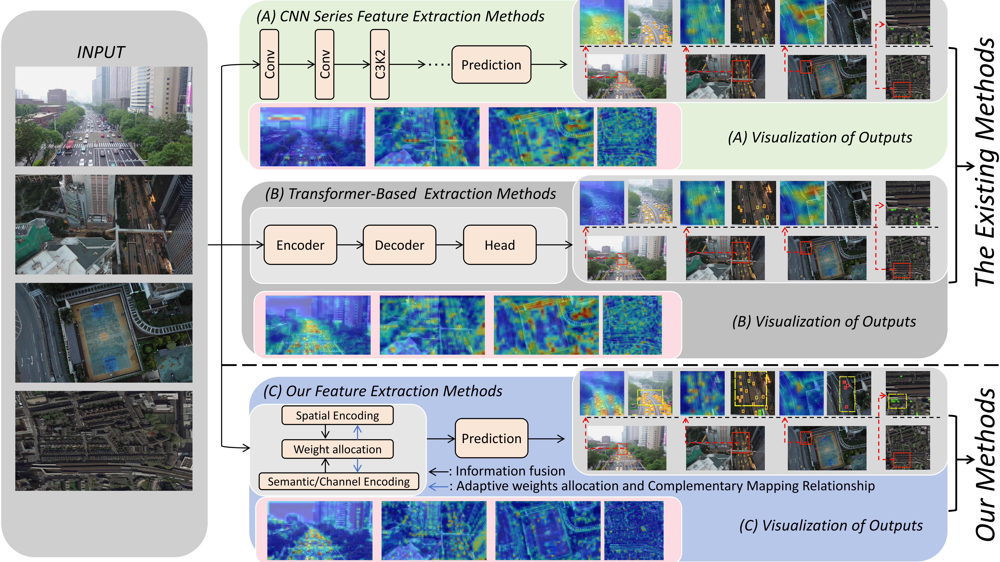
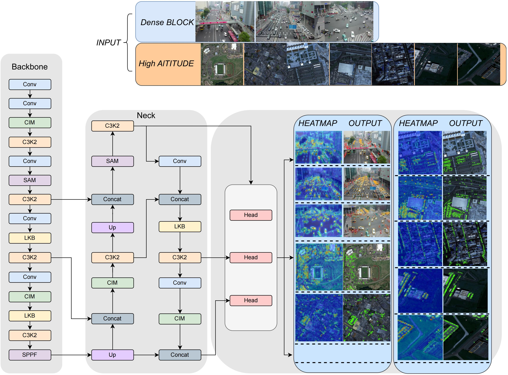

# CEL-Net
The corresponding paper title for this project is “R2-YOLO: A Reliable and Resource-efficient Small Object Detector For UAV Aerial Images”. 

In the future, various data and codes in the paper will gradually be opened up.



# Object Detection



## 1、Requirements

We highly suggest using our provided dependencies to ensure reproducibility:

```
pip install requirements.txt
```

## 2、Train your Net

```
yolo detect train data=cfg your data.yaml model=your model.yaml epochs=500 batch=128 imgsz=640 device=[0,1]
```

## 3、Main Results 

| **Models** | **Input Size** | **FLOPs (G)** | **Params (M)** | Precision |
| ---------- | -------------- | ------------- | -------------- | --------- |
| CEL-Net-N  | 640x640        | 7.7           | 2.64           | 51.8      |
| CEL-Net-S  | 640x640        | 22.5          | 4.93           | 54.6      |
| CEL-Net-M  | 640x640        | 48.4          | 48.4           | 54.9      |
| CEL-Net-L  | 640x640        | 81.9          | 81.9           | 55.2      |
| CEL-Net-X  | 640x640        | 122.3         | 122.3          | 59.2      |

If you have any questions, please feel free to contact us.
